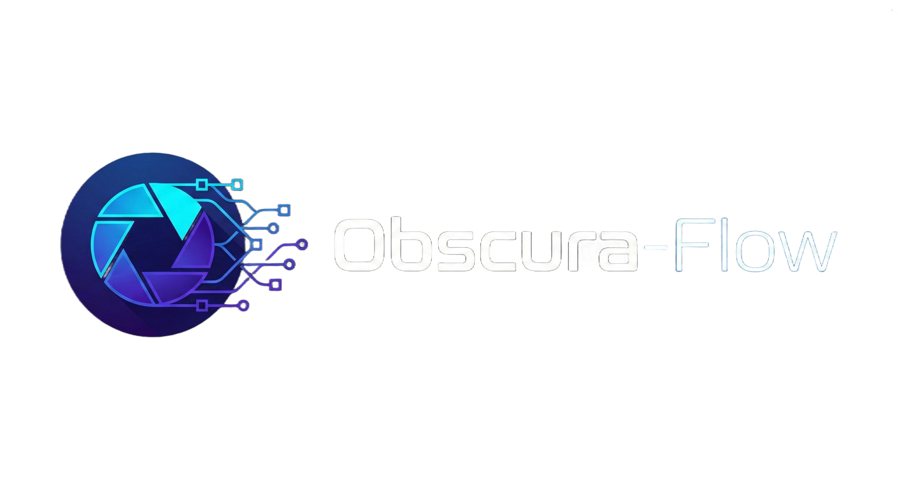

<p align="center">
  
</p>

<p align="center">
  <b>A minimalist, dark-themed neural network architecture visualizer and PyTorch code generator.</b>
</p>

<p align="center">
  <a href="https://obscura-flow.vercel.app"></a>
  
  
  
  
</p>

---

## Live Demo

Try ObscuraFlow right now — no installation required:

**[https://obscura-flow.vercel.app](https://obscura-flow.vercel.app)**

---

## Features

- **Visual Model Builder** — Drag-and-drop neural network layers onto an infinite canvas
- **Connect Layers** — Link layers together to form complete architectures
- **Live Shape Inference** — Automatic tensor shape calculation as you build
- **PyTorch Export** — Generate clean, production-ready `nn.Module` code with one click
- **Real-time Updates** — Parameter changes instantly propagate through the network
- **Dark Theme** — Beautiful, eye-friendly interface designed for focus

## Supported Layers

| Layer | Description |
|-------|-------------|
| **Input** | Define your input tensor shape (C, H, W) |
| **Conv2D** | 2D Convolutional layer with configurable kernel, stride, padding |
| **MaxPool2D** | 2D Max Pooling for spatial downsampling |
| **Linear** | Fully connected (Dense) layer |
| **Flatten** | Collapse spatial dimensions to 1D |
| **ReLU** | Rectified Linear Unit activation |
| **Dropout** | Regularization via random zeroing |
| **BatchNorm2D** | Batch normalization over 4D input |

## Quick Start

**Prerequisites:** Node.js (v18+)

```bash
# Clone the repository
git clone https://github.com/XBastille/obscura-flow.git
cd obscura-flow

# Install dependencies
npm install

# Start development server
npm run dev
```

Open [http://localhost:3000](http://localhost:3000) in your browser.

## Tech Stack

- **React 18** — UI framework
- **TypeScript** — Type-safe development
- **Vite** — Lightning-fast build tool
- **ReactFlow** — Node-based graph canvas
- **Zustand + Immer** — Lightweight state management
- **Tailwind CSS** — Utility-first styling
- **Lucide React** — Beautiful icons

## Project Structure

```
obscura-flow/
├── components/
│   ├── Canvas/          # ReactFlow canvas & layer nodes
│   ├── Modals/          # Code export modal
│   └── Sidebar/         # Layer palette & property inspector
├── constants/           # Default layer configurations
├── store/               # Zustand state management
├── types/               # TypeScript type definitions
├── utils/
│   ├── codeGenerator.ts # PyTorch code generation
│   ├── nodeFactory.ts   # Layer node creation
│   └── shapeCalculator.ts # Tensor shape inference
├── public/              # Static assets (logo, favicon)
├── App.tsx              # Main application
└── index.html           # Entry point
```

## Scripts

| Command | Description |
|---------|-------------|
| `npm run dev` | Start development server |
| `npm run build` | Build for production |
| `npm run preview` | Preview production build |

## Documentation

See [USAGE.md](USAGE.md) for a guide on how to use ObscuraFlow, including step-by-step tutorials and architecture examples.

---

<p align="center">
  <b>If you find this project useful, consider giving it a ⭐ — it helps others discover it!</b>
</p>

## License

MIT License — feel free to use this project for personal or commercial purposes.
